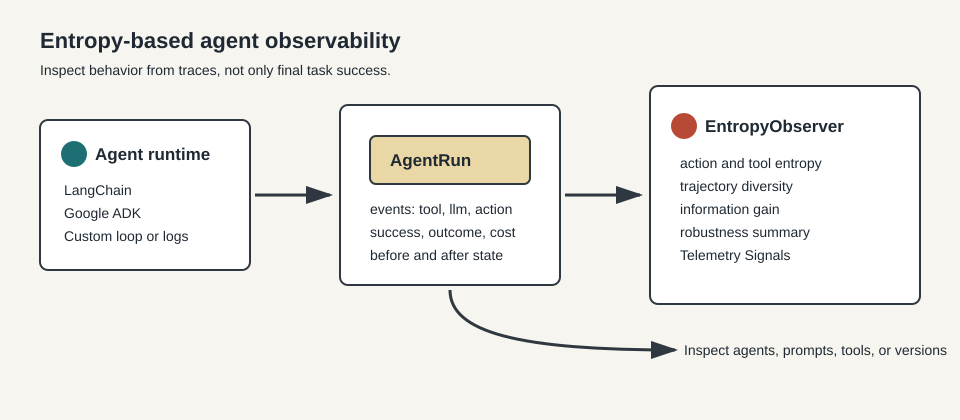
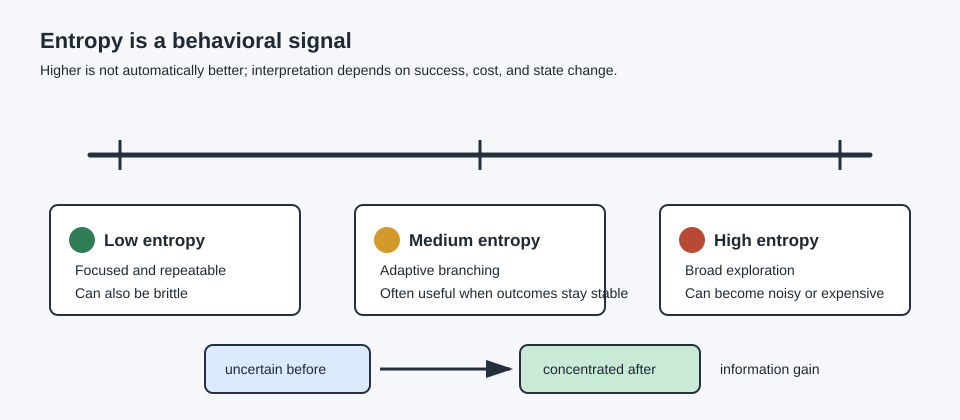

# Concept Overview

Entropy-Based Observability for AI Agents, or EOA, is a way to inspect agent behavior from traces. Traditional dashboards often foreground final task completion. EOA adds trace-derived telemetry that describes uncertainty, branching, tool use, trajectory variation, and outcome stability on the path to that result.



The central idea is:

1. Capture an agent trace.
2. Normalize that trace into an `AgentRun`.
3. Compute entropy-based observability signals over actions, tools, trajectories, state changes, and outcomes.
4. Inspect those signals across agents, prompts, tools, models, releases, or production trace samples.

## Why Entropy

Entropy measures how spread out a distribution is. In EOA, that distribution can be the set of actions an agent chooses, the tools it calls, the full trajectories it follows across repeated runs, or the hypotheses it assigns probability to before and after solving a task.

This makes entropy useful for observability because it describes behavioral structure, not agent quality by itself. Two runs can both succeed while showing different tool dependence, different trajectory stability, or different uncertainty reduction.

## The Trace Boundary

`AgentRun` is the integration boundary. Framework-specific details stay outside the observer. LangChain callbacks, Google ADK events, custom ReAct loops, database traces, or JSON logs all become the same shape:

```json
{
  "task_id": "qa-001",
  "events": [
    {"kind": "tool", "name": "search"},
    {"kind": "tool", "name": "read"},
    {"kind": "action", "name": "answer"}
  ],
  "success": true,
  "cost": 0.08,
  "before": {"correct": 0.45, "distractor": 0.55},
  "after": {"correct": 0.92, "distractor": 0.08}
}
```

The observer can then work with a single run or a corpus of runs without knowing which agent framework produced them.

## Behavioral Signals



Entropy values are signals, not grades. A high value is not automatically good, and a low value is not automatically bad.

Low entropy can mean the agent is focused, predictable, and efficient. It can also mean the agent has become brittle and does not adapt when the task changes.

Medium entropy can be healthy when the agent branches across useful strategies while still producing stable outcomes.

High entropy can indicate broad exploration, but it can also reveal noisy tool use, indecision, or unnecessary cost.

The strongest interpretation comes from reading entropy together with success rate, information gain, cost, outcome entropy, and qualitative trace review.

## What EOA Helps You Inspect

Use EOA when you want to inspect behavior across:

- two agent frameworks
- two prompt versions
- two model choices
- agents with different tools enabled
- repeated runs of the same task
- a controlled workload and a production trace sample

The result is a behavioral profile. It helps identify whether a change made traces more variable, more rigid, more tool-concentrated, more outcome-unstable, or more expensive. The trace and task context determine what those changes mean.
